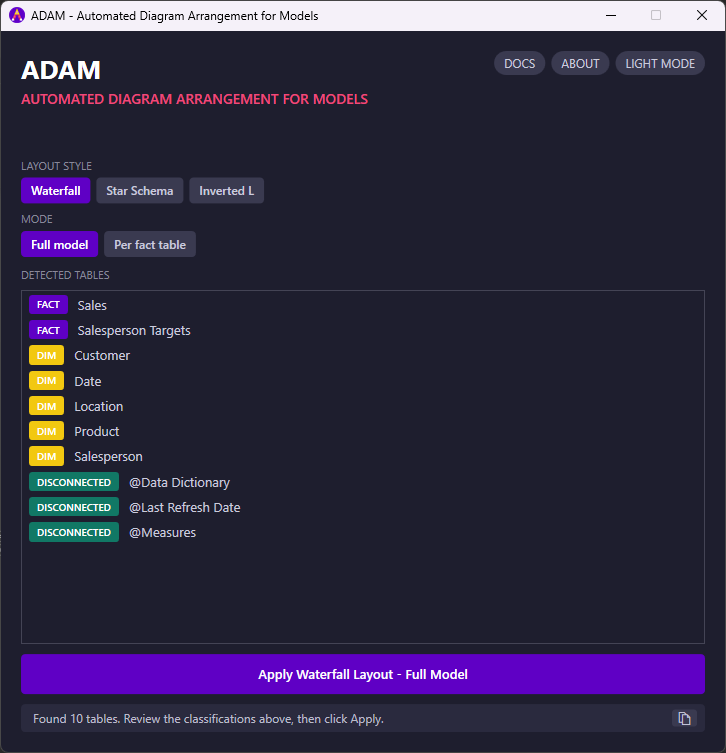
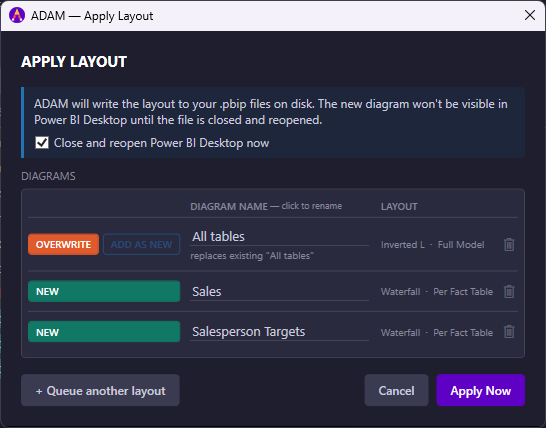

# ADAM - Automated Diagram Arrangement for Models

> **A free Power BI External Tool by [Greyskull Analytics](https://www.greyskullanalytics.com)**  
> *Data Solutions that make businesses better*

| Channel | Version | Description |
|---------|---------|-------------|
| **Release** | <!--RELEASE-->[v1.0.0](https://github.com/GreyskullAnalytics/Automated-Diagram-Arrangement-for-Models/releases/tag/v1.0.0) | The latest fully tested release, recommended for most users. |
| **Pre-release** | <!--PRERELEASE-->[v0.8.2](https://github.com/GreyskullAnalytics/Automated-Diagram-Arrangement-for-Models/releases/tag/v0.8.2) | ⚠️ Work in progress - features and behaviour may change and bugs may be present. Use at your own risk. |

ADAM automatically arranges the tables in your Power BI model view into clean, readable diagrams - eliminating the hours spent manually dragging tables around every time your model changes.



---

## Why use ADAM?

Anyone who has opened the **Model view** in Power BI Desktop on a complex semantic model knows the pain: tables scattered randomly, relationship lines crossing each other, impossible to read. ADAM fixes this in one click.

- Supports **Waterfall**, **Star Schema**, and **Inverted L** layout styles
- Automatically classifies tables as facts, dimensions, bridges, outriggers, and disconnected - overrides are remembered automatically, so you only ever correct a table once
- **Per-fact diagrams** - one focused diagram per fact table for large, complex models
- **Queue multiple layouts** and apply them all in a single Power BI close/reopen cycle
- Minimises crossing relationship lines using barycenter ordering
- Works with both `.pbip` (recommended) and `.pbix` files
- **CLI mode** for headless, AI-assisted workflows - no Power BI Desktop session required
- Launched from the **External Tools** ribbon (installer) or directly as a standalone app (portable)
- Switch between multiple open Power BI files without restarting ADAM
- Dark mode support with system-default theme detection, or toggle manually
- **Release channel indicator** and **automatic update checks** - a colour-coded pill shows whether you're on a release or pre-release build, and a banner appears when a newer version matching your channel is available
- Remembers your last-used layout style across sessions

---

## Requirements

- **Power BI Desktop** (any recent version)
- **Windows 10 / 11** (x64)
- .NET 8 runtime *(included in the self-contained download - no separate install needed)*

---

## Installation

### Option A - Installer (recommended)

1. Download `ADAM-setup-x.x.x.exe` from [Releases](../../releases)
2. Run the installer - it handles everything including External Tools registration
3. Restart Power BI Desktop

> Requires local admin rights. Ask your IT team if needed.

### Option B - Portable (no admin required)

1. Download `ADAM-standalone-x.x.x.exe` from [Releases](../../releases)
2. Place it anywhere on your machine (Desktop, a shared folder, etc.)
3. Launch `ADAM.exe` directly

The portable version does **not** appear in the External Tools ribbon. Instead, open your Power BI file first, then launch ADAM and select the file from the dropdown - ADAM will detect all currently open Power BI Desktop instances and let you connect to one.

> **Windows SmartScreen warning**
>
> When running the installer or the portable `.exe` you may see a "Windows protected your PC" message listing the publisher as unknown. This is expected - ADAM is not yet code-signed with a paid certificate. It is safe to proceed:
>
> 1. Click **More info**
> 2. Click **Run anyway**
>
> Greyskull Analytics is working towards a signed release in a future version. In the meantime, the portable `.exe` (Option B above) can be used as an alternative if your organisation does not allow unsigned installers.

### Uninstalling

Open ADAM, click **ABOUT**, then click **Uninstall**. This runs the same uninstaller as Windows' "Add or remove programs" and requires the same admin rights as installation. For a portable install, just delete `ADAM.exe` - there's nothing else to clean up.

### Staying up to date

ADAM checks GitHub for new releases each time it starts. If a newer version matching your current channel (release or pre-release) is available, a banner appears with a **Download now** button that takes you straight to the download - or dismiss it for the session and check again next launch. The version pill next to the ADAM title always shows exactly what you're running, coloured pink for release builds and yellow for pre-release builds.

---

## How to use

1. Open your `.pbip` or `.pbix` file in Power BI Desktop
2. Launch ADAM:
   - **Installer**: click **ADAM** in the External Tools ribbon - ADAM opens connected to the active file automatically
   - **Portable**: launch `ADAM.exe` directly, then select your open Power BI file from the dropdown and click **Connect**
3. Review the table classifications in the list - override any you disagree with using the dropdown on each row
4. Choose a **Layout Style** and **Mode**
5. Click **Apply Layout** - an **Apply window** opens showing every diagram that will be created, with any naming conflicts highlighted inline
6. Optionally rename diagram tabs, resolve conflicts with **Overwrite** / **Add as new** (or resolve them all at once with the "Resolve all" buttons), remove unwanted diagrams with the trash icon, or click **+ Queue another layout** to stage a second layout before anything is written
7. Click **Apply Now** - ADAM writes everything in one step



For `.pbip` files, the Apply window includes an option to close and reopen Power BI Desktop immediately (so the new diagrams are visible straight away) or leave it open and reopen manually at your convenience. ADAM remembers your preference.

For `.pbix` files the close-and-reopen cycle is mandatory - the Apply window makes this clear upfront before you commit.

### Working with multiple Power BI files

Click **CHANGE** next to the connection status at any time to switch ADAM to a different open Power BI file without restarting it. If you launch ADAM again from the External Tools ribbon of a second file while it's already open, ADAM switches to that file automatically instead of opening a second window - any Apply window or queued layout for the previous file is discarded.

### Layout Styles

| Style | Description |
|-------|-------------|
| **Waterfall** | Dimensions at the top, facts at the bottom. Positions are optimised to minimise crossing relationship lines. Best for most models. |
| **Star Schema** | Facts at the centre, dimensions radiating outward in a circle. Mirrors the classic star schema structure. |
| **Inverted L** | Facts in a left column, dimensions in a top row. Works well for models with many fact tables. |

### Modes

| Mode | Description |
|------|-------------|
| **Full Model** | One diagram containing all tables, named `All Tables - [Style]`. |
| **Per Fact Table** | One diagram per fact table, containing only that fact's related dimensions and ancestor tables. Named after the fact table. Ideal for large models. |

### Table Classification

ADAM automatically classifies each table based on its relationships:

| Badge | Classification | How detected |
|-------|---------------|--------------|
| 🟣 FACT | Fact table | Table name starts with `Fact`/`Fct`, OR many-side of relationships spanning multiple columns, OR the many side of a single relationship |
| 🟡 DIM | Dimension | Primarily on the one-side of relationships |
| 🔵 BRIDGE | Bridge table | Bidirectional relationship, single key column, sits between a fact and a dimension |
| 🔴 OUTRIGGER | Outrigger bridge | Bidirectional relationship, single key column, connects only to other dimensions |
| 🟢 DISCONNECTED | No relationships | Not connected to any other table |

You can override any classification using the dropdown on each row before applying. Overrides are remembered automatically - written as an annotation into the table's TMDL file for `.pbip` models, or saved in ADAM's settings for `.pbix` models - so you won't need to correct the same table twice.

Power BI's auto-generated hidden date/time tables (`DateTableTemplate_...`, `LocalDateTable_...`) are excluded from ADAM entirely and never appear in the table list.

---

## Using ADAM with AI assistants

ADAM includes a **CLI mode** and an accompanying **AI skill file** so that AI assistants (Claude, GitHub Copilot, and others) can apply layouts on your behalf without opening the desktop application.

### CLI usage

```
ADAM.exe --cli --file "MyModel.pbip" [--style waterfall|star-schema|inverted-l] [--mode full|per-fact] [--diagram "Name"] [--overwrite]
```

| Flag | Default | Description |
|------|---------|-------------|
| `--file <path>` | *(required)* | Path to the `.pbip` project |
| `--style <name>` | `waterfall` | `waterfall`, `star-schema`, or `inverted-l` |
| `--mode <name>` | `full` | `full` (one diagram for all tables) or `per-fact` (one diagram per fact table) |
| `--diagram <name>` | Auto-generated | Custom name for the diagram (full-model mode only) |
| `--overwrite` | *(not set)* | Overwrite an existing diagram with the same name instead of adding a numeric suffix |
| `--list-classifications` | *(not set)* | Report every table's classification without applying a layout. Cannot be combined with `--style` |
| `--set-classification "Table=Type"` | *(not set)* | Override a table's classification (`Fact`, `Dimension`, `Bridge`, `OutriggerBridge`, `Disconnected`). Repeatable; can be combined with `--style` to override and apply in one step |

- Reads table and relationship metadata directly from the `.pbip` TMDL files on disk - no Power BI Desktop session required.
- Writes the updated `diagramLayout.json` in place and persists classification overrides as TMDL annotations, exactly like the desktop app. Close and reopen the file in Power BI Desktop to see the result.
- **CLI mode only supports `.pbip` projects** - `.pbix` files and thin reports must be laid out using the desktop app instead.
- Exits with code `0` on success, `1` on error. Progress and results are written to stdout.

### AI skill file

The file `adam-skill.md` (available on the [Releases](../../releases) page and in `docs/`) describes ADAM's capabilities, arguments, and decision guidance in a format optimised for AI assistants. Drop it into your AI workflow and the assistant will know how and when to invoke the CLI.

Supported platforms: **Claude** (Claude Code), **GitHub Copilot**, and any assistant that accepts markdown skill or instruction files.

---

## Notes on .pbix vs .pbip

ADAM is designed primarily for the `.pbip` (Power BI Project) format. When used with `.pbix` files, ADAM will warn you that this is an unsupported operation and will create a timestamped backup before making changes.

Microsoft recommends migrating to `.pbip` for all new development. You can convert by using **File → Save As → Power BI Project** in Power BI Desktop.

Note: [CLI mode](#cli-usage) only supports `.pbip` - `.pbix` files must be laid out using the desktop app.

---

## Thin reports (not supported)

Thin reports - Power BI files whose semantic model is hosted in the Power BI Service rather than stored locally - are **not supported by ADAM**.

ADAM reads model metadata (tables, relationships, column counts) directly from the local Analysis Services instance that Power BI Desktop runs when a file is open. Thin reports do not have a local model for ADAM to read, so automatic table classification is not possible.

If you open a thin report and launch ADAM from the External Tools ribbon, you will see a "Thin Reports Not Supported" message. After dismissing it, ADAM will show the file picker so you can connect to a different open Power BI file instead.

### What to do instead

- Open the **semantic model** (`.pbip` or `.pbix`) directly in Power BI Desktop rather than a thin report that references it.
- If you only have the thin report, consider downloading the semantic model from the Power BI Service and working with it locally.
- If you have other Power BI files already open in Desktop, select one from the dropdown after dismissing the message.

---

## Support ADAM

ADAM is free and always will be. If it saves you time, Greyskull Analytics would really appreciate your support - it helps keep tools like this coming.

[](https://buymeacoffee.com/greyskullanalytics)

---

## Get Help & Support

If you need help using ADAM or want to report an issue, please contact support:

- **Email:** [support@greyskullanalytics.com](mailto:support@greyskullanalytics.com)
- **Website:** [greyskullanalytics.com](https://www.greyskullanalytics.com)


---

## Licence

ADAM is free to use for personal and commercial purposes. See [LICENSE](LICENSE) for full terms.

---

## About Greyskull Analytics

[Greyskull Analytics](https://www.greyskullanalytics.com) builds data solutions that make businesses better. ADAM is a free tool shared with the Power BI community.

*By the Power of Greyskull!*

---

<sub>ADAM was built in collaboration with AI (Claude by Anthropic). All features are manually tested against real Power BI Desktop sessions before release - covering both the Store App and Standalone Installer variants, across `.pbip` and `.pbix` file formats - to ensure the tool behaves correctly in the environments you actually use.</sub>